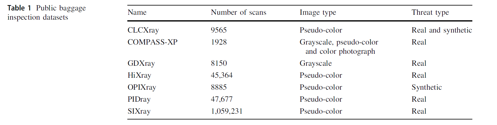
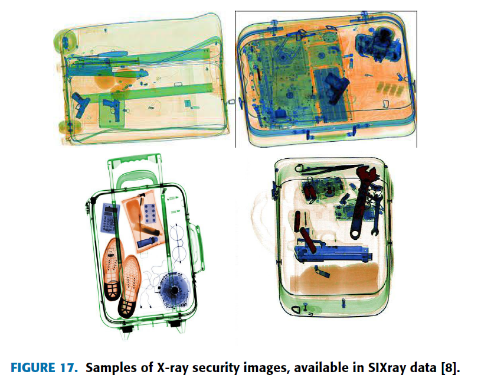
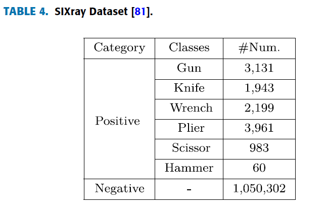
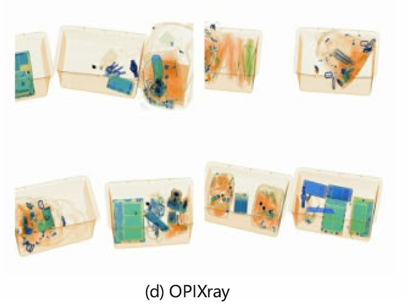
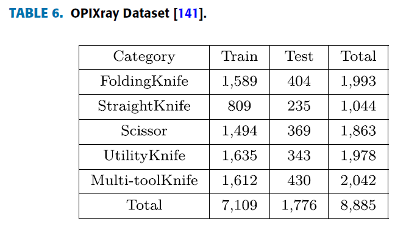
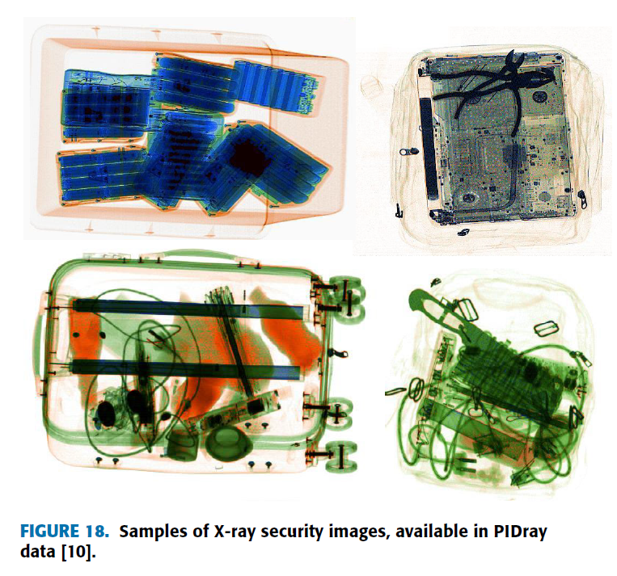
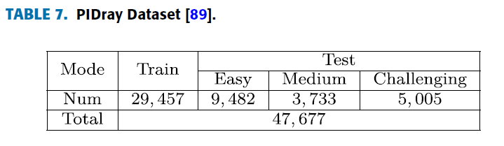
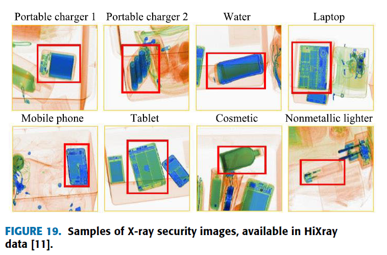
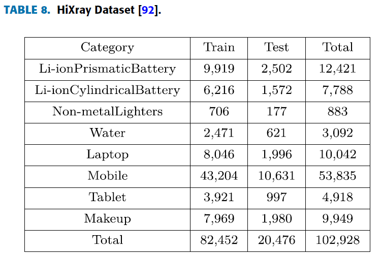

## :dragon_face: 公开数据集
:chart_with_upwards_trend: [2D: 18] [3D: 2]

|Name       | Type | Year | Class |Prohibited - Negative| Annotations| Views|Open Source | 
|-----------|------|------|-------------|-------------|------|-----|------|
|DVXRAY    |2D    | 2024 |15           |10,000 - 22,0000 | bbox| 2     |[[Link]](https://ieeexplore.ieee.org/document/10458082)  |
|FSOD       |2D    | 2022 |20            |12,333 - 0 | bbox|1     |[[Link]](https://github.com/DIG-Beihang/XrayDetection)  |
|EDS       |2D    | 2022 |10            |14,219 - 0 | bbox|1     |[[Link]](https://github.com/DIG-Beihang/XrayDetection)  |
|Xray-PI       |2D    | 2022 |12            |2,409 - 0 | bbox, segm|1     |[[Link]](https://github.com/LPAIS/Xray-PI)  |
|PIXray       |2D    | 2022 |12            |5,046 - 0 | bbox, segm|1     |[[Link]](https://github.com/Mbwslib/DDoAS)  |
|CLCXray       |2D    | 2022 |12            |9,565 - 0 | bbox|1     |[[Link]](https://github.com/GreysonPhoenix/CLCXray)  |
|HiXray       |2D    | 2021 |8            |45,364 - 0 | bbox|1     |[[Link]](https://github.com/DIG-Beihang/XrayDetection)  |
|PIDray    |2D    | 2021 |12           |47,677 - 0  | bbox, segm|1     |[[Link]](https://github.com/bywang2018/security-dataset)       |
|OPIXray    |2D    | 2020 |5            |8,885  - 0 | bbox |1     |[[Link]](https://github.com/OPIXray-author/OPIXray)           |
|SIXray     |2D    | 2019 |6            |8,929 - 1,050,0302 | bbox |1 |[[Link]](https://github.com/MeioJane/SIXray)           |
|COMPASS-XP     |2D    | 2019 |366            |1928 - 0 | -- |1 |[[Link]](https://zenodo.org/record/2654887#.YUtGVHVKikA)           |
|GDXray       |2D    | 2015 |5            |19,407 - 0 | bbox |1     |[[Link]](https://domingomery.ing.puc.cl/material/gdxray/)  |
---

## a: GDXray
- Grima X-Ray 数据集包含 19,407 张铸件、焊缝、行李、自然图像和背景图像。
虽然该数据集包含多视图行李检测图像，但由于场景单一，且呈现是单能X射线束，是 Gray-scale 灰色图，不适合在其上部署当代大规模深度学习算法。

## b: Compass-XP 
- 每个X射线图像包包含低能量、高能量、材料密度、灰度（低能量和高能量的组合）和伪彩色RGB的不同图像版本，非常适合研究X射线成像原理。但是，它不适合基于深度学习的目标识别任务。

## c: SIXray
- 该数据集包含**1059231**张X射线图像，分为**枪支、刀具、扳手、钳子、剪刀和锤子** **六** 大类。SIXray数据集还原了实际场景，是一类正（危险品）负（非危险品）样本严重不平衡的数据集，适合用于实时检测。
在文章的实验部分，作者设置了**SIXray10、SIXray100和SIXray1000三个子数据集**，其中前两个子数据集中的数字10和100代表正常物品与违禁物品的比例。

SIXray 主要关注 **六类违禁品**：
1. **枪支**  
2. **刀具**  
3. **扳手**  
4. **钳子**  
5. **剪刀** 
6. **锤子**

- 例如，在SIXray10数据集中，共有98219幅图像，其中8929幅为违禁物品，89290幅为正常物品。 SIXray1000 子数据集由 1,000 张随机选择的禁止图像和 1,050,302 张普通图像混合而成。
原始数据集论文提供了两个不同任务的结果：image-level classification(图像级分类)和 object detection。这两个任务针对每个危险品的类别分别进行评估。
- （1）对于图像级分类，根据测试图像包含特定对象的概率对其进行排序，并使用 mAP评估结果，类似于 Pascal VOC 分类挑战。但是目标是对整张图像进行分类，输出该图像所属的类别。例如，给一张安检图像，分类模型只能判断这张图像中是否存在危险品，但无法告诉你危险品具体在哪里。
- （2）对于object detection，评估的方法分别为每个类生成热图，并使用对象定位精度评估性能

## d: OPIXray
OPIXray 是一个用于 X 光安检的伪彩色数据集，专门用于研究遮挡情况下的违禁品检测。
该数据集的背景图像均由真实的安检机扫描获得，违禁品则通过专业软件**合成**到这些背景中，确保数据的多样性和真实性。

数据集包含 **8,885 张 X 光图像**，所有图像均由国际机场的专业安检员**手动标注**，每个违禁物品均配备边界框（Bounding Box）。
数据集中所有图像均至少包含 **一件违禁品**，部分图像可能包含多个。数据以 **JPG 格式** 存储，分辨率为 **1225 × 954**。

OPIXray 主要关注 **五类违禁品**：
1. **直刀（Straight Knife）**  
2. **折叠刀（Folding Knife）**  
3. **美工刀（Utility Knife）**  
4. **多功能刀（Multitool Knife）**  
5. **剪刀（Scissors）**  

### 数据集划分：
- **80% 训练集**（用于模型训练）  
- **20% 测试集**（用于评估模型性能）  
  - 测试集进一步分为 **OL1、OL2、OL3** 三个子集，这些子集包含**不同遮挡程度**的违禁品，用于分析模型在不同遮挡条件下的检测能力。

### 任务与评估：
- 该数据集的主要任务是 **目标检测（Object Detection）**，即识别违禁品类别并进行精确定位。  
- 评估指标采用 **mAP（均值平均精度）**，IoU（交并比）阈值设定为 **0.5**，即 **mAP@0.5**。
- 

## e: PIDray
PIDray 是一个**大规模 X 光安检数据集**，专门用于**检测违禁品**，特别是**故意隐藏的违禁品**，涵盖了多种现实场景。
该数据集包含 **47,677 张真实安检图像**，图像来源于**机场、火车站、地铁站**，并使用了**三种不同厂商的安检设备**进行扫描。
因此图像具有不同的**尺寸、颜色和分辨率**，增强了数据的多样性。

### **数据特点**
- 每张图像至少包含 **一件违禁品**，部分违禁品经过**刻意遮挡**，提高检测任务的挑战性。  
- 数据集提供 **高质量的标注**，包括：
  - **边界框（Bounding Box）**，用于目标检测  
  - **分割掩码（Segmentation Mask）**，用于实例分割  
- 数据集支持 **分类、目标检测、实例分割** 三类任务。

### **违禁品类别**
PIDray 数据集共包含 **12 类违禁品**：
1. **刀（Knife）**  
2. **枪（Gun）**  
3. **剪刀（Scissors）**  
4. **打火机（Lighter）**  
5. **喷雾器（Sprayer）**  
6. **警棍（Baton）**  
7. **扳手（Wrench）**  
8. **钳子（Pliers）**  
9. **锤子（Hammer）**  
10. **手铐（Handcuffs）**  
11. **充电宝（Power Bank）**  
12. **子弹（Bullet）**  

### **数据集划分**
- **60% 训练集**（Train Set）  
- **40% 测试集**（Test Set）  
  - 测试集进一步分为 **三类难度**：
    - **Easy（容易）**：较少遮挡  
    - **Medium（中等）**：适度遮挡  
    - **Challenging（困难）**：高度遮挡  

### **评估指标**
- 主要评估标准为：
  - **平均精度（Average Precision, AP）**  
  - **平均召回率（Average Recall, AR）**  
- 计算方式基于 **12 类违禁品** 和 **10 个 IoU（交并比）阈值（0.5 - 0.95）**，以衡量检测和分割任务的准确性。

## f: HiXray
HiXray 是一个**高质量 X 光安检图像数据集**，专门用于**违禁品检测**。该数据集是**当前包含违禁品数量最多的数据集（截至 2022 年）**，共包含 **102,928 件违禁物品**，数据均来源于**真实机场安检**，并由**专业安检员手动标注**。

### **数据特点**
- **数据量大**：包含 **45,364 张伪彩色 X 光图像**，图像格式为 **JPG**，平均分辨率 **1200 × 900**。  
- **目标密集**：每张图像平均包含 **2.27 个违禁品**。  
- **高质量标注**：所有违禁品均配备**边界框（Bounding Box）**，便于目标检测任务。  
- **适用于多种检测任务**：
  - **目标检测（Object Detection）**  
  - **小目标检测（Small Object Detection）**  
  - **遮挡目标检测（Occluded Object Detection）**  

### **违禁品类别**
HiXray 数据集共包含 **8 类违禁品**：
1. **锂离子方形电池（Lithium-ion Prismatic Battery）**  
2. **锂离子圆柱电池（Lithium-ion Cylindrical Battery）**  
3. **液体（水）（Water）**  
4. **笔记本电脑（Laptop）**  
5. **手机（Cell Phone）**  
6. **平板电脑（Tablet）**  
7. **化妆品（Cosmetics）**  
8. **非金属打火机（Non-metallic Lighter）**  

### **数据集划分**
- **80% 训练集（Train Set）**  
- **20% 测试集（Test Set）**  

### **评估指标**
- 主要评估标准为：
  - **mAP（均值平均精度）**  
- 计算方式基于 **IoU（交并比）阈值 0.5（mAP@0.5）**。

### **总结**
HiXray 是目前**最大规模、最高质量**的 X 光安检数据集之一，适用于**违禁品目标检测、小目标检测、遮挡目标检测**等任务，可广泛用于提升安检系统的智能识别能力。

## g: CLCXRAY
CLCXray 是一个专注于**安检图像中遮挡问题**的 X 光数据集。与 OPIXray 数据集类似，CLCXray 也关注物品的重叠问题，但相比之下，CLCXray 的数据具有**更复杂的重叠情况**，包括**目标之间的重叠**以及**目标与背景的相似性**。此外，与 OPIXray 的**合成图像**不同，CLCXray **包含大量真实安检图像**，并且在数据规模、标注质量和威胁类别数量上都更具优势。

### **数据特点**
- **数据量大**：共包含 **9,565 张伪彩色 X 光安检图像**，其中：
  - **4,543 张真实地铁安检图像**
  - **5,022 张模拟行李图像**
- **高质量标注**：
  - 由**专业安检员**进行标注
  - 提供 **COCO 格式** 标注，包括**边界框（Bounding Box）**
- **复杂场景**：
  - 物品重叠程度高，背景复杂
  - 适用于检测**遮挡目标、小目标、大目标**等任务  
- **图像分辨率**：介于 **373 × 200 到 732 × 1280** 像素之间  
- **目标密集**：数据集中包含 **20,000+ 件潜在危险物品**，每张图像平均包含 **2 件以上**  

### **违禁品类别**
CLCXray 数据集涵盖 **12 类威胁物品**，包括：
1. **5 类刀具（Cutters）**：
   - 刀片（Blade）  
   - 小刀（Knife）  
   - 匕首（Dagger）  
   - 剪刀（Scissors）  
   - 瑞士军刀（Swiss Army Knife）  
2. **7 类液体容器（Liquid Containers）**：
   - 罐装饮料（Cans）  
   - 纸盒装饮料（Carton Drinks）  
   - 塑料瓶（Plastic Bottle）  
   - 玻璃瓶（Glass Bottle）  
   - 保温杯（Vacuum Cup）  
   - 金属罐（Tin）  
   - 喷雾罐（Spray Cans）  

### **数据集划分**
- **80% 训练集（Train Set）**  
- **10% 验证集（Validation Set）**  
- **10% 测试集（Test Set）**  

### **评估指标**
CLCXray 采用 **COCO 评估标准**，计算多个 IoU（交并比）阈值下的检测性能，包括：
- **mAP（均值平均精度）**：计算 10 个 IoU 级别（0.5:0.05:0.95）的均值  
- **mAP50**：IoU=0.5 时的 mAP  
- **mAP75**：IoU=0.75 时的 mAP  
- **mAPs**：小目标（面积 < 32²）检测精度  
- **mAPm**：中等目标（32² < 面积 < 96²）检测精度  
- **mAPl**：大目标（面积 > 96²）检测精度  

### **总结**
CLCXray 是目前**针对遮挡问题最具挑战性**的安检 X 光数据集，具有**丰富的真实场景**、**高密度目标**和**高质量标注**。它特别适用于**遮挡目标检测、小目标检测、大目标检测**等复杂任务，对提升安检模型在复杂环境下的检测能力具有重要价值。