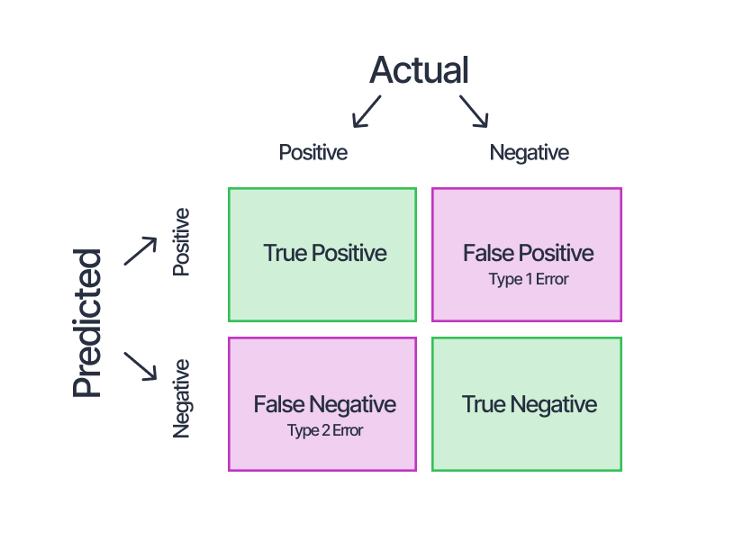
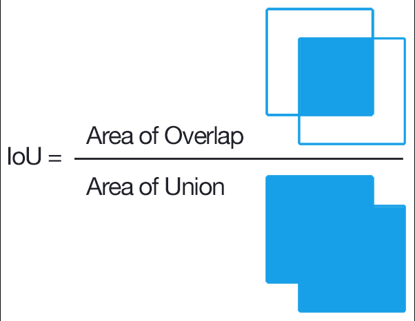
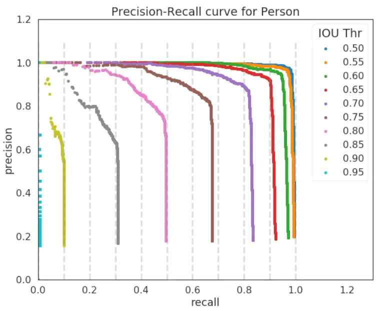

### **目标检测中的 mAP 计算流程（以危险品检测为例）**  

当前的任务是 **检测危险品**，其中 **"positive" 代表危险品**。mAP（Mean Average Precision）用于衡量模型在检测（预测）不同类别的危险品时的整体表现（模型预测的正确率），既要减少误报，也要减少漏报。  

---

## **🔹 1. 预测结果输出**
模型对每张安检图像进行检测，对于每个检测框输出：  
- **预测框（bounding box）**：通常用4个数值表示
  - **(x, y)**：预测框的左上角坐标
  - **(w, h)**：预测框的宽度和高度
  **或者表示为：**
  - **(x_min, y_min)**：预测框左上角坐标
  - **(x_max, y_max)**：预测框右下角坐标
- **置信度（confidence score）**：一个 0~1 之间的数值，表示模型对该预测的确信程度
- **类别概率（class probabilities）**：每个可能的类别都有一个概率值
  - 例如有N个类别，每个框都会输出N个类别概率值
  - 最终类别：选择概率最高的类别作为预测类别（如"手枪"、"刀具"、"炸药"等）

### **输出后处理**
原始网络输出需要经过以下后处理步骤：

1. **基于 Anchor Boxes 的解码**：
   - 网络基于预定义的 anchor boxes 输出预测值
   - 每个网格点会预测多个 anchor boxes 的调整值
   - 这导致原始输出包含大量冗余的检测框

2. **NMS (Non-Maximum Suppression)**：
   - 目的：消除对同一物体的重复检测框
   - 工作流程：
     1. 按置信度对所有预测框进行降序排序
     2. 选择置信度最高的框保留
     3. 计算该框与所有其他框的IoU
     4. 移除IoU大于阈值的其他框（因为可能是对同一物体的重复检测）
     5. 重复步骤2-4，直到处理完所有预测框

最终输出格式：(x, y, w, h, confidence, class_id)，即每个检测框的位置坐标、置信度和预测类别。

---

## **🔹 2. 按置信度排序**
所有预测的危险品按照 **置信度降序排列**，即模型最确信的预测排在最前面，优先进行评估。  
对每个类别（如 手枪、刀具 等）预测出的所有框按**置信度**降序排序。置信度高的框表示模型对其预测为危险品的确信程度较高

---

## **🔹 3. 计算 True Positive（正确检测）、False Positive（误报）和 False Negative（漏报）**

### **IoU (Intersection over Union) 计算**
IoU用于衡量预测框与真实框的重叠程度：

\[IoU = \frac{Intersection\ Area}{Union\ Area} = \frac{预测框与真实框的交集面积}{预测框与真实框的并集面积}\]

- **交集（Intersection）**：预测框与真实框重叠的区域面积
- **并集（Union）**：预测框与真实框覆盖的总面积（去除重叠部分）
- **IoU取值范围**：[0,1]，值越大表示重叠程度越高

1. 选定一个 **IOU 阈值**（通常是 **0.5**），即预测框与真实框的重叠程度需要超过 50% 才算正确检测。  
2. 依次遍历排序后的预测框，并与 **真实框（标注的危险品）** 进行匹配：
   - **如果预测框与某个真实危险品的 IOU ≥ 0.5**，且该真实危险品还没有被其他预测框正确检测到，则此预测被认为是 **正确检测（TP）**。  
   - **如果一个真实危险品有多个预测框匹配**，则选择 **IOU 最高的那个作为正确检测（TP），其他的预测框算误报（FP）**。  
   - **如果预测框没有匹配到任何真实危险品，或者 IOU < 0.5，则判定为误报（FP）**。  
   - **如果某个真实危险品没有被任何预测框匹配到，则算作漏报（FN）**。  

**关键概念关联：**
  - **TP（True Positive）**：预测框与某个真实框的IoU超过阈值，且分类正确。

  - **FP（False Positive）**：预测框与真实框IoU低于阈值，或分类错误。

  - **FN（False Negative）**：真实目标未被检测到（漏检）。
---

## **🔹 4. 计算 Precision-Recall 曲线**
根据所有 **正确检测（TP）、误报（FP）和漏报（FN）** 计算：  
- **精准率（Precision）=  正确检测数量 / (正确检测数量 + 误报数量)**  
- \[Precision =  \frac{TP}{TP + FP}   = \frac{TP}{All\ Observations}\]
  
  - **All Observations（所有观测值）** 指模型预测出的所有正样本数量，假设模型对一张图预测了100个物体框（无论是否与真实框匹配），这些都属于“所有观测值”。
  - 代表**模型预测为危险品的物品中，真正是危险品的比例**。 即模型预测危险品的正确率
  - 极高的 Precision可能意味着模型过于谨慎，仅在极少数、极确定的情况下才预测物品为“危险品”，导致许多危险品漏检，实现通行效率的时候却带来了带来安全隐患，这时候需要适当降低分类阈值，目前的分类阈值可能太高，导致只有模型非常有把握时才预测“危险品”。
适当降低分类阈值，使得模型在不那么确定的情况下也能预测“危险品”，从而提高召回率（Recall），减少危险品的漏检。
- **召回率（Recall）= 正确检测数量 / (正确检测数量 + 漏报数量)**  
- \[Recall =  \frac{TP}{TP + FN}   = \frac{TP}{All\ Ground\ Truth}\]

  - **All Ground Truth（所有真实标注）** 指数据集中实际存在的真实目标数量，即 TP + FN（False Negative）,一张图中有10个真实标注的猫，无论模型检测到多少，这个数字都是固定的。
  - 代表**所有真实存在的危险品中，有多少被正确检测出来**。  即所有危险物品的识别率
  - **极高**的Recall意味着模型简单的将所有物品预测为危险品，增加了通行效率的大打折扣，适当提高分类阈值，让模型更谨慎地预测“危险品”，只有当它足够有把握时才做出此判断，从而减少误报，提升精准率（Precision）
目前的分类阈值可能太低，导致模型过于激进，即只要稍微怀疑是危险品，就直接判定为“危险品”。
- **绘制 Precision-Recall 曲线**，即观察不同召回率下的精准率变化。  

---

## **🔹 5. 计算每个危险品类别的 AP（平均精准率）**
- 选择 **11 个固定召回率（0, 0.1, 0.2, …, 1.0）**，计算该召回率下的精准率，并取其平均值，得到该类别的 **AP（平均精准率）**。  
- 例如，**手枪、刀具、炸药等危险品分别计算 AP**，即 **AP_手枪, AP_刀具, AP_炸药**。  

---

## **🔹 6. 计算 mAP（所有危险品类别的平均 AP）**
- 对所有危险品类别的 AP 取平均，得到 **mAP（Mean Average Precision）**，用于衡量**目标检测模型**整体检测性能：  
  \[
  mAP = \frac{1}{N} \sum_{i=1}^{N} AP_i
  \]
  其中 \( N \) 是危险品类别数。  

---

## **🔹 7. mAP 在危险品检测中的意义**
- **mAP 高**：说明模型在所有类别的危险品检测中，既减少了误报，也减少了漏报，表现良好。  
- **mAP 低**：说明模型在某些类别上误报过多或漏报严重，需要优化。  
- **通过调整分类阈值（置信度阈值）、IOU 阈值等，找到误报和漏报的平衡点，优化检测效果。**  

---

### **🎯 总结**
1. **模型输出预测框、置信度和类别。**  
2. **按置信度排序预测框。**  
3. **用 IOU 判断哪些是正确检测、误报和漏报。**  
4. **计算 Precision-Recall 曲线。**  
5. **计算各类别的 AP（平均精准率）。**  
6. **计算 mAP，评估整体危险品检测性能。**  

通过 mAP，能更直观地评估模型对 **危险品检测的整体表现，确保既减少误报、又降低漏报，从而优化安全检查的效率和准确性。** 🚄🚧